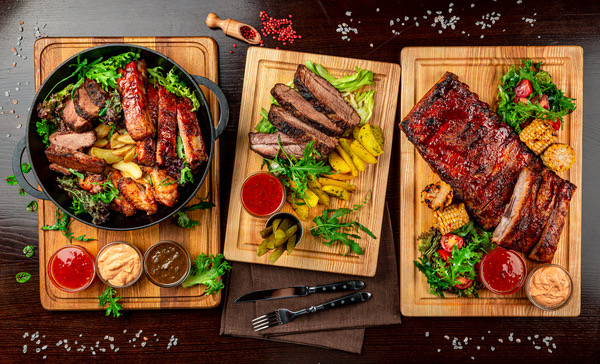
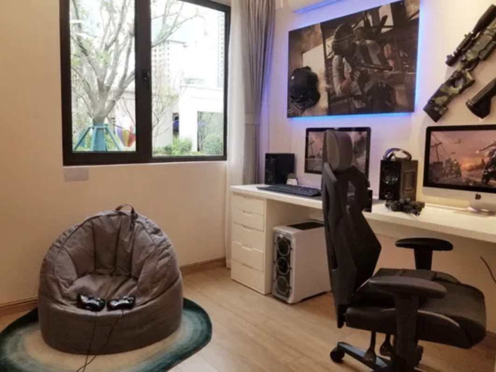

<html lang="zh-CN">
<head>
    <meta charset="UTF-8">
    <meta name="viewport" content="width=device-width, initial-scale=1.0">
    <title>✨ 朱玲仪的个人主页</title>
    
    
</head>
<body class="min-h-screen py-12 px-4">
    

        <!-- 个人信息头部 -->
        

            <h1 class="text-4xl md:text-5xl font-bold text-pink-700 mb-4" style="font-family: KaiTi, serif;">
                ✨ 朱玲仪（Eileen） ✨
            </h1>
            

                🎓 毕业于波士顿大学数据分析专业，现在在项目上完成作为Operation Analyst的相关工作
            

        

        <!-- 照片展示 -->
        

            

                <h2 class="text-xl font-bold mb-4 flex items-center">
                    📸 我的靓照
                </h2>
                
            

        

        <!-- 美食最爱 -->
        

            

                <h2 class="text-xl font-bold mb-4 flex items-center">
                    🍖 我的美食最爱
                </h2>
                

                    
                    

                        没有烤肉的夏天是不完整的！滋滋作响的烤肉才是灵魂伴侣！🥩
                    

                

            

        

        <!-- 兴趣爱好 -->
        

            

                <h2 class="text-xl font-bold mb-4 flex items-center">
                    🎮 学习之余，我最大的爱好是...
                </h2>
                

                    
                    

                        
放下书本，我就会立刻投身于

                        
唱歌和打游戏

                        
最常玩的游戏是 守望先锋！

                    

                

            

        

        <!-- 个人信息卡片 -->
        

            <!-- 小标签 -->
            

                

                    <h2 class="text-xl font-bold mb-4 flex items-center">
                        🔮 关于我的一些"小标签"
                    </h2>
                    

                        

                            
星座：

                            
♉️ 省钱与奢华的矛盾体：在不感兴趣的地方极度抠门，在热爱的事物上一掷千金。

                        

                        

                            
MBTI：

                            
🔧 ISTP，动手达人就是我！喜欢把想法变成现实

                        

                    

                

            

            <!-- 隐藏技能 -->
            

                

                    <h2 class="text-xl font-bold mb-4 flex items-center">
                        🤫 我的隐藏技能
                    </h2>
                    

                

            

        

        <!-- 糗事和小缺点 -->
        

            <!-- 糗事卡片 -->
            

                

                    <h2 class="text-xl font-bold mb-4 flex items-center">
                        😅 让我记忆犹新的糗事
                    </h2>
                    <button onclick="toggleContent('embarrassing')" class="btn mb-4">
                        点击查看糗事
                    </button>
                    

                        

                            在第一年留学的时候跟朋友购物，在结账时收银员问我：How's your day today， 我听成了How's your date，并说我不是同性恋，没有在dating😂
                        

                    

                

            

            <!-- 小缺点卡片 -->
            

                

                    <h2 class="text-xl font-bold mb-4 flex items-center">
                        🙈 我的小缺点
                    </h2>
                    <button onclick="toggleContent('quirks')" class="btn mb-4">
                        点击查看缺点
                    </button>
                    

                        

                            人无完人嘛，我承认我是 重度懒癌患者！
                            能躺着绝不坐着，能坐着绝不站着，床就是我的第二个家～
                            每次周末计划要早起学习，结果都在床上和被子缠绵到中午😴
                        

                    

                

            

        

        <!-- 未来寄语 -->
        

            

                <h2 class="text-xl font-bold mb-4 flex items-center">
                    💌 对 2026 年的自己说句话
                </h2>
                

                    

                        "Hi，一年后的我，希望你能够在项目上成为一个成熟的能为团队兜底的OA，并且游戏技术更上一层楼！🎮"
                    

                

            

        

    

    
</body>
</html>
